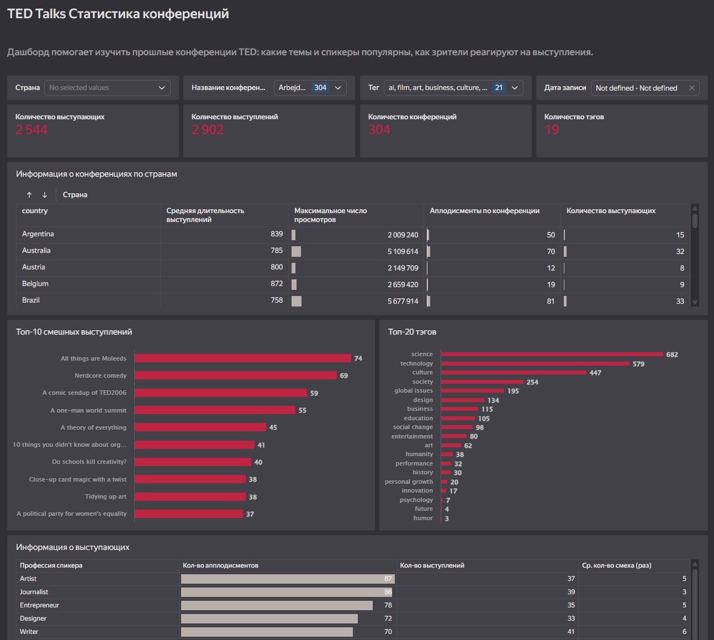

## 🌐 Ссылка на дашборд

🔗 [Открыть интерактивный дашборд в Yandex DataLens](https://datalens.yandex/dq6soeesp7c8y)

---

# 📊 Dashboard TED Talks

Интерактивный дашборд, посвящённый анализу данных о конференциях **TED**.  
Цель проекта — помочь организаторам новых мероприятий в формате TED понять, **какие темы, спикеры и форматы наиболее привлекательны для аудитории**, и на основе этого спланировать успешную конференцию.

---

## 🎯 Цель дашборда

Дашборд позволяет ответить на ключевые вопросы:

- Какие **темы и теги** наиболее популярны?
- Как **зрители реагируют** на разные темы (просмотры, аплодисменты)?
- Сколько **спикеров** обычно участвует в одной конференции?
- Какова **средняя длительность** выступлений?
- Кто из **спикеров вызывает наибольший интерес**?

---

## 🧭 Структура дашборда

1. **Общая статистика** — количество конференций, выступлений, уникальных спикеров и тегов.  
2. **Конференции по странам** — средняя длительность выступлений, максимальные просмотры, количество аплодисментов и спикеров.  
3. **Выступления** — топ-10 самых смешных и топ-20 самых популярных по тегам.  
4. **Спикеры** — чем занимаются самые интересные для зрителей спикеры, у кого больше аплодисментов.  
5. **Детализация** — возможность открыть карточку конкретного выступления с описанием, тегами и ссылкой на оригинал.

---

## 🔍 Фильтры

Дашборд можно фильтровать по:

- стране  
- конференции  
- тегу  
- дате записи  

---

## 🖼️ Скриншот

---

## 🛠️ Технологии и инструменты

- **Yandex DataLens** — визуализация и аналитика данных  
- **Python / Pandas** — подготовка и очистка данных  
- **Excel / CSV** — исходные наборы данных  
- **SQL** — агрегация и трансформация данных  

---

## 📬 Контакты

Если у вас есть вопросы или предложения — буду рад обсудить:  
**Email:** [ваш.email@example.com]  
**Telegram:** [ваша ссылка]
**LinkedIn:** [ваша ссылка]

